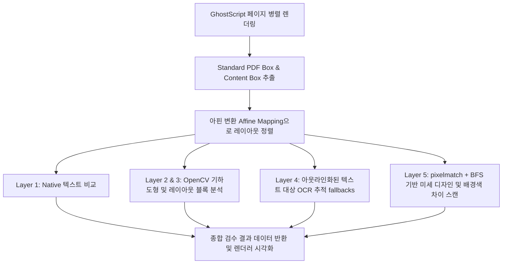

# PDF & AI 툴킷 (PDF & AI Toolkit)

비디오, 인쇄 및 출판 분야의 그래픽 디자이너와 검수자를 위한 고정밀 **PDF/AI 텍스트 아웃라인 변환** 및 **시각적/의미론적 3단계 비교(Diff) 하이브리드 검수 프로그램**입니다.

이 문서에는 프로젝트의 전체 폴더 구조, 구현된 핵심 기능의 아키텍처 및 내부 알고리즘 로직이 매우 상세하게 기록되어 있어, **새로운 개발자나 AI 에이전트가 코드를 즉시 파악하고 곧바로 기능 추가 및 디버깅을 시작할 수 있습니다.**

---

## 📂 프로젝트 폴더 구조 (Folder Structure)

```bash
smart-pdf-&-ai-merger/
├── bin/                        # 임베디드 로컬 바이너리 실행 엔진
│   ├── gs/                     # Ghostscript 10.02.1 (인쇄용 아웃라인 및 고해상도 벡터 렌더러)
│   └── mutool.exe              # MuPDF CLI (초고속 Native 텍스트 추출 및 기하 영역 스캔)
├── workers/
│   └── compare.worker.cjs      # 핵심 멀티스레드 비교 파이프라인 (OpenCV.js, Tesseract.js, pixelmatch)
├── src/                        # React Client (Vite + TSX)
│   ├── features/
│   │   └── compare/
│   │       └── CompareTab.tsx  # 동기식 스크롤, 미세 차이 하이라이팅, 무시 규칙 제어 듀얼 뷰어 UI
│   ├── App.tsx                 # 통합 대시보드 인터페이스
│   ├── index.css               # 테일윈드/VanillaCSS 커스텀 디자인 시스템
│   └── main.tsx                # React 엔트리포인트
├── main.cjs                    # Electron 메인 프로세스 (IPC 핸들러 제어 및 백그라운드 워커 스레딩)
├── preload.cjs                 # 안전한 렌더러-메인 IPC 브릿지
├── package.json                # 의존성 모듈 및 빌드 스크립트
└── tsconfig.json               # 타입스크립트 컴파일 구성
```

---

## 🛠️ 핵심 기능 및 작동 아키텍처 (Key Features & Logic)

### 1. 텍스트 아웃라인 변환 (Text Outlining Process)
* **목적**: 인쇄용 또는 유통용 문서를 만들기 위해 폰트 유실 우려가 없는 벡터 외곽선(Outline) 상태로 텍스트 오브젝트를 강제 래스터라이징하지 않고 벡터로 패스화합니다.
* **로직 및 명령어**:
  Electron 메인 프로세스(`main.cjs`의 `process-outline` 핸들러)에서 Ghostscript 바이너리(`gswin64c.exe`)를 백그라운드에서 구동합니다:
  ```bash
  gswin64c.exe -o [출력파일] -dNOPAUSE -dBATCH -sDEVICE=pdfwrite -dCompatibilityLevel=1.6 -dNoOutputFonts=true [입력파일]
  ```
  `-dNoOutputFonts=true` 플래그는 PDF 내부에 삽입된 모든 폰트 문자를 외곽선 패스(Vector Path)로 완벽하게 변환하여 완전히 아웃라인화된 고정밀 인쇄용 파일을 보존합니다.

---

### 2. 하이브리드 비교 분석 엔진 (`workers/compare.worker.cjs`)
이 워커 파일은 단일 CPU 스레드가 멈추지 않도록 Electron `Worker Thread` 내부에서 실행되며, **오류 오탐(False Positive)을 획기적으로 줄이고 아웃라인 텍스트 및 미세 디자인 변경을 잡아내는 5단계 분석 알고리즘**으로 구동됩니다.



#### **[Step 1] GhostScript 고해상도 병렬 렌더링**
* 문서를 정확히 픽셀 단위로 스캔하기 위해 두 문서를 **DPI 150(혹은 설정값)**으로 GhostScript를 사용하여 임시 디렉토리에 고해상도 PNG 파일들(`a1.png`, `b1.png` 등)로 Spawns 병렬 변환합니다.

#### **[Step 2] 아웃라인 및 아트보드 보정 (Content Box & Affine Translation)**
* PDF의 여백이나 대지 크기가 미세하게 다를 때 발생하는 대규모 오차를 방지합니다.
* `getContentBoundingBox(png)` 알고리즘을 통해 OpenCV 컨투어 스캔으로 흰색 배경이 아닌 실제 인쇄 디자인 요소가 위치한 핵심 사각형 영역(Content Bounding Box)을 추출합니다.
* A 문서와 B 문서의 Content Box의 폭과 좌표를 기준으로 **아핀 변환(Affine Scale/Offset)**을 도출하여 B 문서 내부 모든 오브젝트의 좌표를 A 문서 좌표계에 정렬(Scaling & Shift Mapping)합니다.

#### **[Step 3] Native 텍스트 기반 비교 (Layer 1)**
* `mutool`을 통해 Native PDF 텍스트 오브젝트들의 문자열과 Bounding Box 좌표를 순식간에 추출합니다.
* 문자를 행(Line) 단위로 묶는 `groupTextIntoLines` 알고리즘을 거친 뒤, A 문서의 특정 행과 정렬된 B 문서의 행을 Dice Similarity 기반으로 1차 매칭합니다.
* **오탐 무시 규칙 엔진(Ignore Rules Engine)**:
  * Native Text 비교 시 미세한 문자 오타 하나도 검수되어야 하므로 `diceSim === 1.0`을 요구합니다.
  * 다만, 숫자가 변경된 경우(가격, 날짜 등)는 1순위 치명적 등급(Critical Severity)으로 필터링하도록 설계되어 있습니다.

#### **[Step 4] OpenCV 도형 및 레이아웃 비교 (Layer 2 & 3)**
* 텍스트 영역을 제외한 도형, 사각형, 선, 프레임 등의 변경 사항을 감지합니다.
* `detectGeo()` 함수에서 이미지 컨투어를 검출하고 텍스트 경계 영역을 마스킹하여 순수 디자인 프레임만 추출합니다.
* 두 도형의 IOU(Intersection over Union) 및 아웃라인 형태, 타입(`rect` vs `shape`)을 매칭하여 도형 이동(Spacing Changed), 크기 변화(Size Changed), 타입 변경(Shape Modified)을 추적합니다.

#### **[Step 5] 고해상도 지역적 벡터 OCR 추적 (Layer 4 - 아웃라인 텍스트 지원)**
* 일러스트레이터 등에서 텍스트가 깨져서(아웃라인화) Native Text 정보가 소멸한 경우를 완벽하게 추적하기 위한 핵심 하이브리드 로직입니다.
* 텍스트 프레임이 감지되었으나 Native Text 매칭에 실패한 영역에 대해 Ghostscript 백그라운드 엔진을 통해 **DPI 300 초고해상도로 타겟 영역 벡터 부분 렌더링**을 수행합니다.
* 추출된 고품질 영역 이미지에 Tesseract.js OCR을 수행하여 텍스트의 실제 의미론적 차이(글자 수정, 신규 추가, 삭제)를 복원해 냅니다.

#### **[Step 6] pixelmatch + BFS 기반 미세 색상 차이 검출 (Layer 5)**
* "배경 색상 변경"이나 "텍스트 미세 디자인 요소 변형"을 스캔하기 위한 최종 레이어입니다.
* Native Text나 기하도형이 덮고 있던 레이아웃 오차 영역(`overlapHandled`에 필터링되지 않음)을 무시하지 않고 전체 Content Box 내에서 순수 픽셀 분석을 통과시킵니다.
* 앤티앨리어싱(Anti-Aliasing)으로 인한 가장자리 잡음을 최소화하기 위해 **외곽 8px 가두리 버퍼(edgeStrip)**를 제외하고 스캔하며, 변경된 픽셀 비율이 **1.5% 미만인 영역은 노이즈로 보고 무시(density filter)**합니다.
* 변경된 픽셀 덩어리를 묶기 위해 **BFS(Breadth-First Search) 알고리즘**을 활용해 인접 오차 픽셀들을 하나의 논리적 덩어리로 그루핑(Bounding Box화)하여 시각적 디자인 변경 영역(이미지/아이콘 변경)으로 명확히 리포팅합니다.

---

### 3. 고기능 듀얼 뷰어 UI (`src/features/compare/CompareTab.tsx`)
* **스크롤 동기화(Synchronized Scrolling)**: 좌우 패널 중 어느 하나를 스크롤하더라도 보정 좌표 스케일에 따라 상대 캔버스의 스크롤 위치가 정밀하게 자동 이동합니다.
* **다차원 상태 검수 필터**: 사용자가 Critical(숫자/페이지 수준 변경), High(텍스트 수정), Medium(도형/구조 변경), Low(미세 위치/스타일 변경) 수준으로 필터링하여 보고서를 정렬할 수 있습니다.

---

## 🏃 개발 및 빌드 명령어 (Development & Build Guide)

### 1. 개발 환경 실행 (Development Mode)
개발을 진행할 때는 프론트엔드용 Vite 서버와 데스크톱용 Electron 러너를 동시에 실행합니다.

* **Step 1 (Vite 구동)**:
  ```bash
  npm run dev
  ```
  *(로컬 포트 3000번에서 프론트엔드 HMR(Hot Module Replacement) 구동)*

* **Step 2 (Electron 실행 - 별도의 터미널 창)**:
  ```bash
  npm run electron:start
  ```

---

### 2. 프로덕션 패키징 및 빌드 (Production Bundle)
로컬에 빌드된 웹 에셋을 컴파일하고 윈도우용 데스크톱 배포 실행 파일(`.exe`)을 패키징합니다.

```bash
npm run electron:build
```
* **빌드 출력 경로**: `release/PDF & AI Toolkit-win32-x64/` 폴더 내에 모든 의존 패키지와 로컬 바이너리가 동봉된 무설치 실행 파일(`PDF & AI Toolkit.exe`)이 단독 생성됩니다.

---

---

## 🌐 사내 배포용 24시간 가동 웹 서비스 가이드 (Hybrid Web Deployment)

본 프로젝트는 데스크톱 일렉트론 앱으로 작동할 뿐만 아니라, 회사 임직원들이 아무런 프로그램 설치 없이 브라우저(URL)만으로 24시간 접속하여 사용할 수 있는 **하이브리드 웹 애플리케이션** 규격이 이미 내장되어 있습니다.

### 1. 로컬 개발 및 API 서버 테스트
로컬에서 프론트엔드를 실행하고, 백엔드 API 서버를 함께 연동하는 방법입니다:
*   **API 서버 구동 (Express)**:
    ```bash
    node server.cjs
    ```
    *(기본 포트 8080번으로 실행되며, 로컬 `bin/gs` 및 `bin/mutool` 엔진을 사용해 백그라운드 연산을 대리 수행합니다.)*
*   **Vite 개발 클라이언트 구동**:
    ```bash
    npm run dev
    ```
    *(브라우저로 `http://localhost:3000`에 접속하면, 일렉트론이 없는 순수 브라우저 환경에서도 백엔드 API와 통신하여 모든 기능이 똑같이 작동합니다.)*

---

### 2. 고성능 24시간 클라우드 배포 (Hugging Face Spaces)
초기 Render.com(512MB RAM) 배포 시 메모리 부족(OOM) 에러가 발생하여, 현재는 **16GB RAM 및 2코어 CPU를 무료로 제공하는 Hugging Face Spaces**에 Docker SDK로 완벽하게 통합 배포되어 있습니다. 백엔드(Express)와 프론트엔드(React)가 하나의 서버에서 구동됩니다.

* **운영 서버 주소 (즐겨찾기용)**: `https://koohawn-ai-pdf-toolkit.hf.space/`
* **메인 관리자 페이지**: `https://huggingface.co/spaces/KOOHAWN/AI_PDF_TOOLKIt`
* **환경 명세**:
  * **프론트엔드**: Vite 빌드 후 `dist` 폴더를 Express 서버가 정적 서빙합니다.
  * **백엔드/엔진**: Node.js `server.cjs`가 7860 포트에서 백엔드와 프론트엔드를 동시에 호스팅합니다.
  * **바이너리 파일(OCR 모델)**: `.traineddata` 파일은 용량이 커서 허깅페이스가 일반 Git 업로드를 거부하므로 반드시 **Git LFS(Large File Storage)**로 트래킹하여 배포됩니다.

---

## 💡 AI/개발자를 위한 핵심 유지보수 지침 (필독)

새로운 AI 에이전트나 개발자가 이 코드를 수정하고 서버에 반영(배포)하려면 다음 규칙을 반드시 따라야 합니다.

0. **README.md YAML 메타데이터 보존 (Configuration Error 방지)**:
   이 파일(`README.md`)의 맨 윗부분 1~10번째 줄에 있는 `---` 로 둘러싸인 YAML 설정값은 허깅페이스가 서버 환경을 구성하는 절대적인 기준점입니다. **어떤 AI 에이전트도 이를 절대 지우거나 훼손해서는 안 됩니다.** 
   만약 누군가 이 설정을 삭제하고 깃허브나 허깅페이스에 푸시(Push)할 경우, 허깅페이스 스페이스 메인 화면에 **`Configuration error: Missing configuration in README`** 라는 빨간색 치명적 오류가 발생하며 서버 전체가 완전히 다운됩니다.
   
   **[ 🚨 긴급 복구 방법 ]**
   에러가 발생했다면 당황하지 말고 `README.md` 파일 맨 위에 정확히 아래 코드를 다시 붙여넣고 커밋/푸시하면 서버가 2~3분 내로 정상 복구됩니다.
   ```yaml
   ---
   title: AI PDF Toolkit
   emoji: 🚀
   colorFrom: blue
   colorTo: purple
   sdk: docker
   pinned: false
   app_port: 7860
   ---
   ```

1. **GitHub 및 Hugging Face 동기화 배포 전략**:
   본 레포지토리는 GitHub(`origin`)와 Hugging Face 원격 저장소 두 곳을 타겟으로 삼습니다. 수정한 코드를 최종 서버에 반영하려면 아래 명령어 순서를 준수해야 합니다.

   ```bash
   # 1. 수정한 코드를 로컬 환경에서 커밋 (LFS 바이너리 파일 포함)
   git add .
   git commit -m "Update feature"

   # 2. GitHub 저장소 백업 및 1차 동기화 (내 PC ↔ 깃허브)
   git push origin main

   # 3. Hugging Face 서버로 실 배포 (강제 덮어쓰기)
   # 주의: 허깅페이스 토큰은 반드시 Write(쓰기) 권한이 있는 Fine-grained 토큰이어야 합니다.
   git push -f https://hf_여기에토큰값@huggingface.co/spaces/KOOHAWN/AI_PDF_TOOLKIt main:main
   ```
   * 위 3번 명령어를 실행하면 약 2~3분 뒤 허깅페이스 서버가 자동으로 새 코드를 빌드하고 서비스를 갱신(`Building` -> `Running`)합니다.

2. **하이브리드 다중 환경 맵핑 (IPC vs HTTP)**:
   * [App.tsx](file:///c:/Users/kkh53/Downloads/smart-pdf-&-ai-merger/src/App.tsx) 및 [CompareTab.tsx](file:///c:/Users/kkh53/Downloads/smart-pdf-&-ai-merger/src/features/compare/CompareTab.tsx)는 클라이언트 실행 시 `window.electronAPI` 객체의 존재 유무를 확인합니다.
   * 일렉트론 래퍼 내에서는 초고속 로컬 파일 IPC(`selectDirectory`, `comparePdfs`)로 무부하 제어하며, 일반 브라우저 환경에서는 백엔드 REST API(/compare-pdfs, /process-outline)로 바이너리를 안전하게 스트리밍하도록 단일 통합 브릿징 설계가 완료되어 있습니다.

3. **인코딩 무결성 준수**:
   * `workers/compare.worker.cjs` 파일 내에는 한국어 리포팅용 문자열("삭제됨", "도형 타입 변경", "아웃라인" 등)이 포함되어 있습니다.
   * 파일 수정 시 PowerShell `Set-Content`나 외부 리디렉션을 사용하면 한글 문자가 UTF-8 바이트로 손상(Mojibake)되므로, 반드시 일반적인 IDE 에디터나 Node.js의 `fs.writeFileSync(..., 'utf8')`로만 편집을 가해야 합니다.

4. **OpenCV 리소스 가비지 컬렉션**:
   * OpenCV.js는 웹어셈블리(Wasm) 힙 메모리를 사용하므로 인스턴스 해제가 누락되면 메모리 누수(OOM)가 발생합니다.
   * `compare.worker.cjs` 내의 `detectTextRegions` 함수나 기타 OpenCV 가공 영역이 끝날 때는 반드시 모든 매트릭스 변수에 대해 `.delete()`를 호출하여 자원을 수동 소거해 주어야 합니다.
